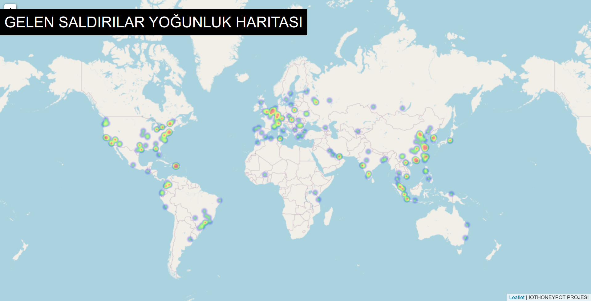
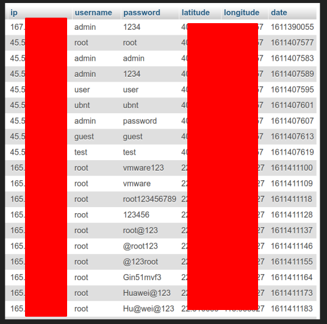
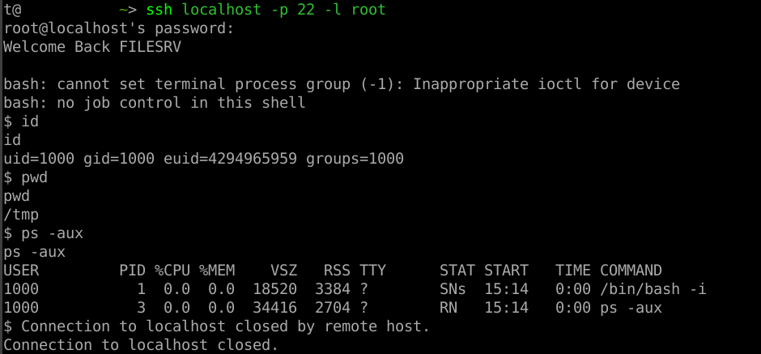

# SSHHONEYPOT

22 portu sahte ssh servisi

8100 portunda saldırı haritası mevcut

8888 portu terciha bağlı phpmyadmin ( docker-compose.yml içerisinden # leri silin)

# KURULUM
`git clone https://github.com/redStarP2/SSHHONEYPOT.git`

`cd ./SSHHONEYPOT`

`sudo ./dockerANDdocker-compose.sh`

`sudo docker-compose up -d`

# TEST

`ssh -l root localhost`

Rastgele parola girin

## 8100 Portu Saldırı Haritası

## Loglanan Veriler

## Örnek bağlantı

